# Assn3_DSP
## Team member(T4)
Wei Fan(wei.fan@vanderbilt.edu Github id: FWWorks)  
Dingjie Su(dingjie.su@Vanderbilt.Edu Github id: sudmat)  
Zhehao Zeng(zhehao.zeng@vanderbilt.edu Github id: frankvandy2018) 

## Project code
https://github.com/FWWorks/Assn3_DSP

## Abstract
We built a layer upon the PUB/SUB model supported by ZMQ and ZooKeeper to support anonymity between publishers and subscribers, and used kazoo to support multiple brokers. We reused most of codes from Assn2, and made progress in adding ownership strength and history to support QoS properties. 

We use ZooKeeper as a way to assign ownership strength, which is used to 'elect' publishers publishing the same topic. Using ZooKeeper, we create new nodes for publishers who publish same topics under the directory '/Topic' and assign monotonically increasing numbers for ownership strength where number 1 is highest strength and so on. The ownership strength is tied to topic so it is possbile for a publisher shows up under 2 different topics when it have registered the two topics. 

We applied this progress to both two approaches. In approach one, which subscribers get publisher's address and go for publisher directly (however we found the instructor call this approach two... whatever...), we made the subscriber only connect to the publisher with the highest strength. Im approach two, where all message dismination conveyed via broker, we make the broker block traffic from lower-ranked publishers. Our implement also supports the situation that the changes of publisher when the highest-ranked publisher dies.

We also applied History QoS for 'offered vs requested' model. We now require a parameter N, which represents samples of information published on a topic be preserved. The rule is, if a publisher maintains last 10 samples while a subscriber wants last 20 samples, then this subscriber cannot get the data even if the topic of interest is common. 

We also did experiments to get a sense of the impact on amount of data sent, latency of dissemination, pinpointing the source of bottlenecks.

The code is written in Python3.5 and we use Mininet to build single topologies to test our code, which runs on Linux Ubuntu.
In addition, we set up experiments on Chameleon cloud. 

## How to run our code

### 0 Install all the requirements.

Install all the requirements using "pip3 install -r requirements.txt", please install it in python3, that's why we are using pip3 instead of pip, of course it doesn't have to be pip3 on your machines, depending on your environment variables.

### 1 If you want to quickly verify the correctness of our program (suggested way to grade our assignment)

You can run our unit test by the following steps,  

1 Start zookeeper on 127.0.0.1:2181 (the unit test does not depend on mininet, so make sure it is running at localhost).  
2 Execute "pytest test" in project home directory (please make sure that the pytest is in python3. If you use pip3 to install the requirements, pytest is naturally in python3, if you have problems with the version issue, feel free to contact us).

The unit test has covered the following content for both modes,  

1 Starting up broker, publisher and subscriber.  
2 Sending and receiving messages in the following scenarios (both strength and history are binded to topic, although not emphasized in the following sentences):  
   a) publishing messages from non-strongest publisher (no receiving)  
   b) publishing messages from publisher with unsatisfying history (no receiving)  
   c) original publisher dies, new publisher with satisfying history becomes the strongest and  messages (receiving)  
   d) original publisher dies, new publisher with unsatisfying history becomes the strongest and  messages (not receiving)  
 
### 2 If you want to manually test our program using a singple topology in mininet

Do as the following steps,  

1 Execute "sudo mn --topo=single,4" to create a simple topology.  
2 Execute "xterm h1 h2 h3 h4" to open windows for nodes.  
3 In h1, start up your zookeeper, which means the zookeeper should be started on 10.0.0.1:2181.  
4 In h2, execute "python3 start_broker.py config/test.ini Broker1" to start the broker.  
5 In h3, execute "python3 start_pub.py config/test.ini Pub1" to start the publisher.  
6 In h4, execute "python3 start_sub.py config/test.ini Sub1" to start the subscriber.  
7 In h3, enter the message you want to publish, watch the subscriber in h4 receiving it.  
Note that in step 7, you need to specify both topic and the message on that topic (in previous assignment, you just need to specify the message, because the topic is default)  
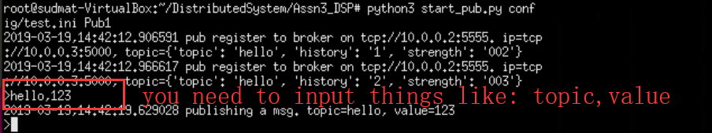

### 3 If you want to manually test our program using other topologies in mininet

In case you want to make further verification, you need to do some configuration work as the following steps,  

1 Define your topology in mininet.  
2 Modifiy the config/test.ini such that all the ip addresses are consistent with your topology.  
3 Start up all the related entities (zookeeper, broker, publisher, subscriber) in proper windows. The commands are similar to what are described above, but make sure you are using the right name to start up broker, publisher and subscriber.  
4 Enter the message you want to publish in publisher window(s), watch the subscriber(s) receiving it.  
Note that in this assignment, configurations of publisher and subscriber are changed a little bit because we will need to bind a history to every topic. You can see it from the following,  
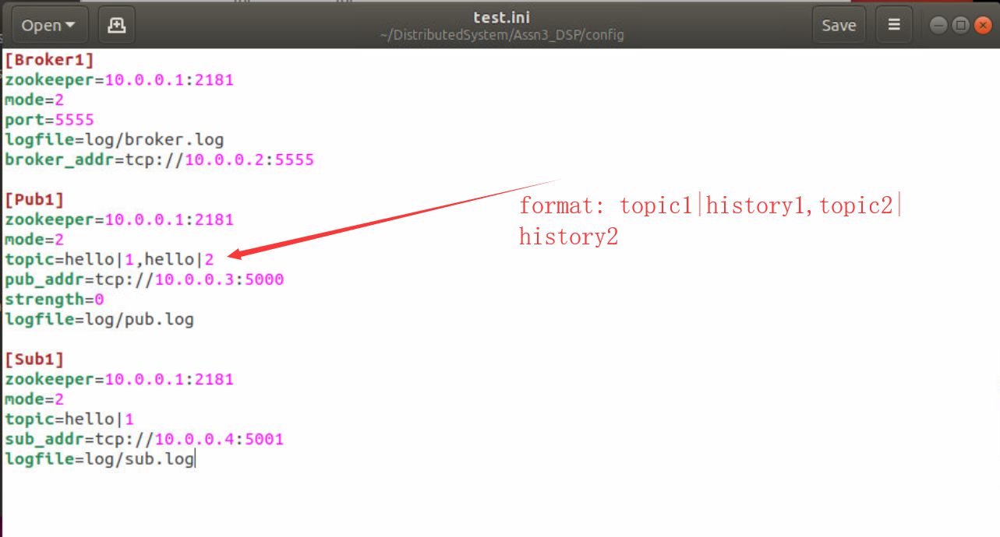

### 4 If you want to test our program using a singple topology on Chameleon.

Chameleon is similar to mininet, but it supplies isolation beyond network (memory, file system, processor are also isolated). If you want to test our program on Chameleon, please do the following,  

1 We have launched 3 machines (named as t4_test, t4_test-1, t4_test-2) on Chameleon and configured their environment as needed. What you need to do is logging in these three machines on https://Chameleoncloud.org using ssh (you may need to contact dingjie.su@vanderbilt.edu to ask for the ssh private key, we cannot uploaded that to github). Once you have logged in all the three machines, you can continue the following.  
2 In t4_test, start up your zookeeper, which means the zookeeper should be started on 129.114.33.20:2181 (the public ip of t4_test).  
3 In t4_test, execute "python3 start_broker.py config/test_chameleon.ini Broker1" to start the broker (zookeeper and broker on the same node).  
4 In t4_test-1, execute "python3 start_pub.py config/test_chameleon.ini Pub1" to start the publisher.  
5 In t4_test-2, execute "python3 start_sub.py config/test_chameleon.ini Sub1" to start the subscriber.  
6 In t4_test-1, enter the message you want to publish, watch the subscriber in h4 receiving it.

The steps 2,3,4,5,6 just image the steps 3,4,5,6,7 in section 3, only that for here it is using Chameleon instead of mininet. 

You will get similar results as with mininet:

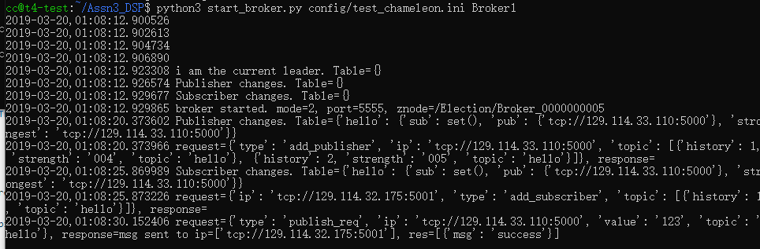

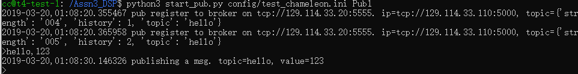

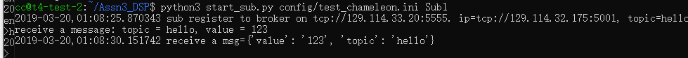

## Performance measurement
It is the same as what we did in previous assignments, that We collected the performance data and did some performance tests on the two approaches of pub/sub model we realized. Related code and data can be found in the 'performance data' file folder.

For simply notation, let's call the approach which subscribers get address of publisher from broker and request message directly from the publisher mode1/approach1, and the approach which subscribers receive messages from broker mode2/approach2. 

We measure performance according to the response time of intervals between a message being published by a publisher and received by a subscriber. For example, if a publisher publishs a message at time A, and this message is successfully received by a subscriber at time B, the intervals(B-A) is what we use to measure the preformance of pub/sub model. For each test, we generated 1000 messages and calculate the average response time and std response time.

We conducted performance by varying number of subscribers for both two approaches to see if data amount or subscriber amount will effect the response time. 

First, we did performance measurement test on mode1/approach1.

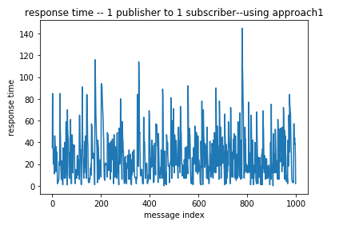

From this plot, we can see the response time of 1000 messages varies from 0~5 microseconds. Except some messages whose response time reach to 5 ms, most data instance show similar response time. We then conduct ploting the std of response time, the std is quite small, showing the system has a good stability. 

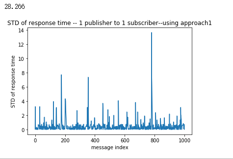

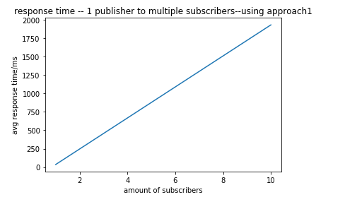

We then conducted measurement on 1 publisher-10 subscriber's model. From this plot we can see, with the subscriber's amount increasing, the average response time shows a positive correlation trend. 

Then we did the same experiments on mode2/approach2.

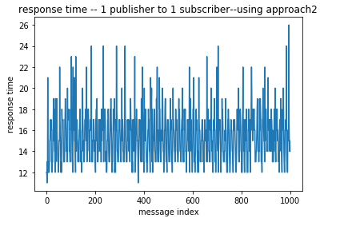

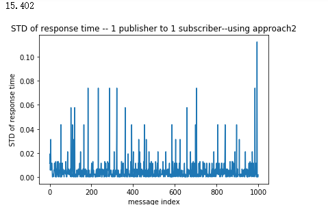

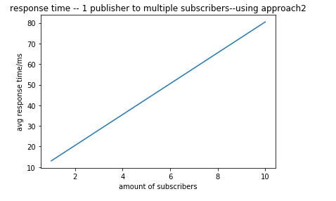

From these results, we can draw the same result like what is described in the tests of approach1, that is, the subscribers' amount influences the performance of response time. The more subscribers the network contains, the more time it takes to convey the message, which means a descrease in the performance. 
But, what makes approach1 and approach2 different is the response time range. It's obvious that using approach2 takes much more time than using approach1 under the same settings. So that's maybe where the bottleneck is, that it takes much time for broker to send messages to subscribers. So to solve this bottleneck, maybe we should do something to make the process of mapping publishers to subscribers faster.

